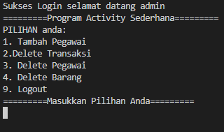

# project-tokoku
    *About*
Tokoku merupakan sebuah program yang dibuat untuk mempermudah sebuah pekerjaan yang berbasis sebuah toko. Dalam program ini terdapat 1(satu) orang admin, pegawai, stock barang, transaksi dan data dari customer toko.

## 1.Admin 
# Admin bertugas mengatur seluruh kegiatan yang terdapat program ini dan memiliki otoritas penuh dalam pengendalian program. Menambahkan data pegawai yang mengakses program dan bisa menghapus semua data yang berada didalam program tanpa terkecuali, kecuali akun pegawai yang sudah tidak bekerja. Serta bisa melakukan seluruh kegiatan dari pegawai.
## 2.Pegawai 
# Pegawai memiliki tugas untuk menambahkan stock barang, mengedit informasi barang, menghapus stock barang, menambahkan data customer, dan membuat nota transaksi pembelian barang.
## 3.Transaksi
# Transaksi adalah fitur penting dalam program ini dimana transaksi dijalankan oleh pegawai sesuai request barang dan jumlah barang yang diinginkan oleh customer.

*Package*

- fmt
- os
- os/exec
- tokoku/admin
- config "tokoku/config"
- tokoku/entity"
- tokoku/pegawai"

## *Instalation*

1. Clone source code dari github
```
git@github.com:ALTA-BE14-RischiYudaOktavianus/project-tokoku.git
```
3. Aplikasi akan mulai dan berjalan
4. Registrasi pegawai jika belum memiliki akun oleh admin
5. Login untuk dapat menggunakan semua fitur yang tersedia

## *Menu*
1. Untuk melakukan run program lakukan seperti contoh dibawah ini: 
    ```
    go run main.go
    ```
2. Akan muncul Menu berikut ini pada terminal:


3. Lalu silahkan input username dan Password. Jika sebagai admin maka akan muncul menu seperti gambar pada menu 4.

=======
